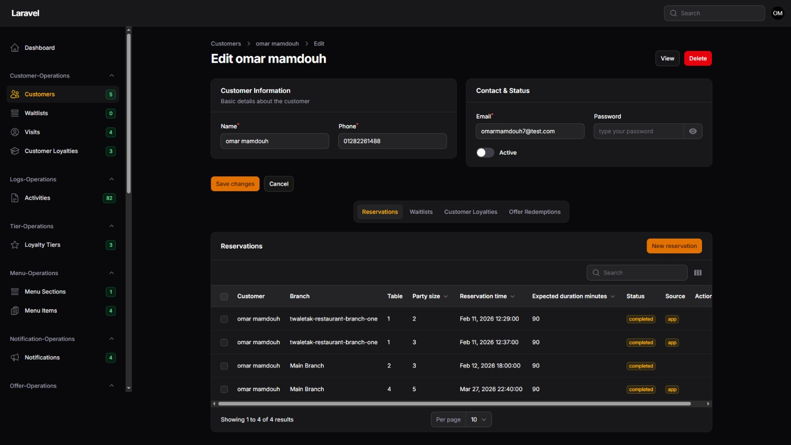

# 🍽️ Tawletak Restaurant – Admin Panel

> A full-featured restaurant management system built with **Laravel**, designed to manage customers, reservations, waitlists, loyalty programs, branches, menus, and more — all from a clean, dark-themed admin dashboard.

---

## 📋 Table of Contents

- [Customer Management](#-customer-management)
- [Reservations](#-reservations)
- [Waitlists](#-waitlists)
- [Visits](#-visits)
- [Customer Loyalties](#-customer-loyalties)
- [Reservation Events](#-reservation-events)
- [Restaurants](#-restaurants)
- [Restaurant Branches](#-restaurant-branches)
- [Restaurant Staff](#-restaurant-staff)
- [Restaurant Roles](#-restaurant-roles)
- [Tables](#-tables)
- [Table Statuses](#-table-statuses)
- [Table Status Histories](#-table-status-histories)
- [Menu Sections](#-menu-sections)
- [Menu Items](#-menu-items)
- [Loyalty Tiers](#-loyalty-tiers)
- [Offer Redemptions](#-offer-redemptions)
- [Notifications](#-notifications)
- [Activities](#-activities)
- [Users](#-users)
- [User Roles](#-user-roles)
- [User Permissions](#-user-permissions)
- [Permissions](#-permissions)

---

## 👤 Customer Management



The **Customers** module is the core of the system. Each customer profile contains their full name, phone number, email, and password for app login. Admins can toggle the customer's **Active** status to enable or disable their access. From the edit page, admins can also view all linked data including reservations, waitlists, loyalty points, and redeemed offers — all accessible through dedicated tabs.

---

## 📅 Reservations


The **Reservations** tab under each customer displays a full history of their bookings. Each reservation record shows the **branch name**, **table number**, **party size**, **reservation time**, **expected duration in minutes**, **status** (e.g., `completed`), and the **source** of the booking (e.g., `app`). Admins can also create a **New Reservation** directly from the customer profile using the dedicated button.

---

## ⏳ Waitlists


The **Waitlists** module tracks customers who are queued and waiting for an available table at a specific branch. Each waitlist entry is linked to a customer and a branch, allowing staff to manage queue flow efficiently. The sidebar shows a live count of active waitlist entries.

---

## 👣 Visits


The **Visits** module records every time a customer physically visits a restaurant branch. This data is useful for tracking customer frequency, analyzing peak hours, and understanding customer behavior patterns across different branches.

---

## 🎖️ Customer Loyalties


The **Customer Loyalties** module tracks the loyalty points each customer has accumulated through their reservations and visits. Points are tied to loyalty tiers and can be redeemed against available offers. Admins can view and manage loyalty balances directly from the customer profile.

---

## 📆 Reservation Events


**Reservation Events** log every status change or action that happens on a reservation (e.g., created, modified, cancelled, completed). This provides a full audit trail for each booking, helping admins and managers track the reservation lifecycle and resolve any disputes.

---

## 🏠 Restaurants


The **Restaurants** module manages the top-level restaurant entities in the system. Each restaurant can have multiple branches, menus, and staff. Admins can create, edit, or delete restaurants and configure their basic information.

---

## 📍 Restaurant Branches


**Restaurant Branches** represent individual physical locations under a restaurant. Each branch can have its own tables, staff, operating hours, and reservations. This allows the system to handle multi-location restaurant chains efficiently.

---

## 👨‍🍳 Restaurant Staff


The **Restaurant Staff** module manages employees assigned to each branch. Each staff member is linked to a branch and assigned a role. This helps in managing access levels and responsibilities for each team member within the restaurant operation.

---

## 🎭 Restaurant Roles


**Restaurant Roles** define the job types within a restaurant (e.g., manager, waiter, host). These roles are assigned to staff members and can be used to control what each staff member is responsible for within their branch.

---

## 🪑 Tables


The **Tables** module allows admins to configure all physical tables across every branch. Each table has a number, capacity, and is linked to a specific branch. Tables are used directly in the reservation and waitlist systems.

---

## 🚦 Table Statuses


**Table Statuses** define the possible states a table can be in — such as `available`, `occupied`, `reserved`, or `cleaning`. These statuses are displayed in real-time on the dashboard to help staff manage floor operations efficiently.

---

## 📜 Table Status Histories


**Table Status Histories** provide a full chronological log of every status change for every table. With 14+ recorded entries, this module is essential for operational auditing and understanding table utilization patterns over time.

---

## 🍕 Menu Sections


**Menu Sections** allow admins to organize the restaurant menu into logical categories such as starters, main courses, desserts, and beverages. Each section acts as a container for related menu items.

---

## 🥗 Menu Items


**Menu Items** are the individual dishes and drinks listed under each menu section. Each item can include a name, description, price, and availability status. The menu is fully manageable from the admin panel.

---

## ⭐ Loyalty Tiers


**Loyalty Tiers** define the levels of the rewards program (e.g., Bronze, Silver, Gold). Each tier has its own thresholds and benefits. Customers are automatically assigned to tiers based on their accumulated loyalty points.

---

## 🎁 Offer Redemptions


The **Offer Redemptions** tab tracks which promotional offers each customer has used. This data helps admins measure the effectiveness of campaigns and ensure that offer usage rules (e.g., one-time use) are enforced correctly.

---

## 🔔 Notifications


The **Notifications** module enables admins to send targeted push or in-app notifications to customers. Notifications can be used to inform customers about upcoming reservations, special offers, loyalty rewards, or general announcements.

---

## 📋 Activities


The **Activities** log records every action performed by admin users within the system (82+ entries). This includes creating, updating, or deleting any resource. It serves as a complete audit trail for accountability and system monitoring.

---

## 👥 Users


The **Users** module manages admin accounts that have access to the dashboard. Each user can be assigned roles and permissions to control what they can view or modify within the system.

---

## 🎯 User Roles


**User Roles** group a set of permissions together and assign them to admin users. This simplifies access management by allowing admins to assign a role instead of configuring permissions individually for each user.

---

## 🔑 User Permissions


**User Permissions** provide granular control over what each admin user can do in the system. With 120+ individual permissions available, the system supports fine-grained access control for every module and action.

---

## 🛡️ Permissions


The **Permissions** registry is the master list of all system-level permissions. These are the building blocks used to construct roles and assign access rights across the entire admin panel.

---

## 🛠️ Tech Stack

| Layer | Technology |
|---|---|
| Backend | Laravel (PHP) |
| Database | MySQL |
| Auth | Laravel Sanctum |
| UI Theme | Dark Admin Dashboard |

---

## 🚀 Getting Started

```bash
# Clone the repository
git clone https://github.com/omar571mamdouh/Tawletak-project.git

# Navigate to backend
cd tawletak-backend

# Install dependencies
composer install
npm install

# Set up environment
cp .env.example .env
php artisan key:generate

# Run migrations and seeders
php artisan migrate --seed

# Start the development server
php artisan serve
```

---

> Built with ❤️ — **Tawletak**, your table is ready. 🍽️